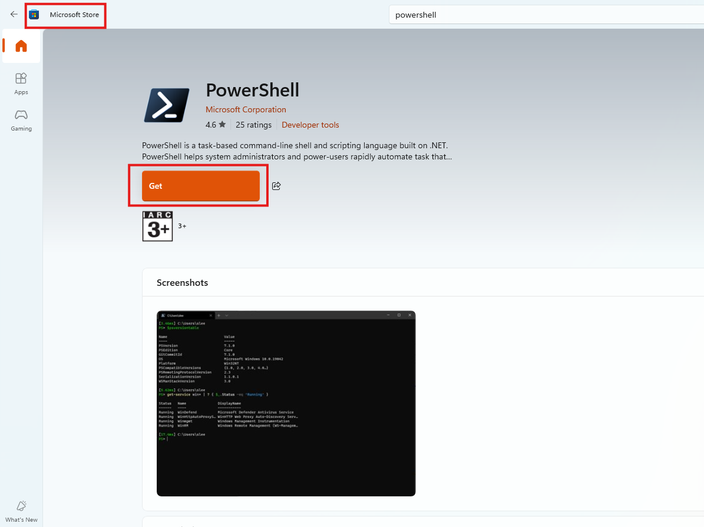
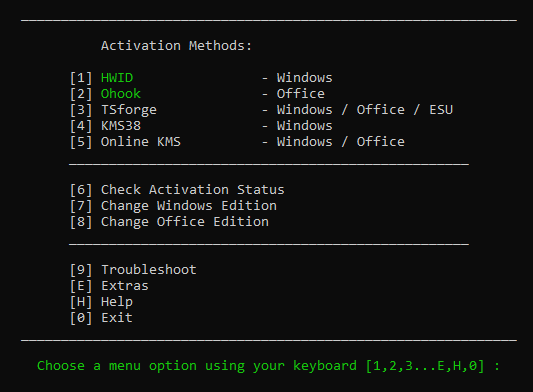

# Activate Windows / Office 

**Step 1:** Open `Microsoft Store` and get `PowerShell`

<div align="center">
    
</div>

**Step 2:** Open `PowerShell` and run this command:
```powershell
irm https://get.activated.win | iex
```

**Step 3:** You will see the activation options: 
- Press [1] HWID for Windows activation.
- Press [2] Ohook for Office activation.

Finally, you should restart your divice.


### Note
- `HWID (Digital License) Method` to Permanently Activate Windows
- `Ohook Method` to Permanently Activate Office
- `TSforge Method` to Permanently Activate Windows/ESU/Office
- `KMS38 Method` to Activate Windows Till the Year 2038
- `Online KMS Method` to Activate Windows/Office For 180 Days (Lifetime With - Renewal Task)


